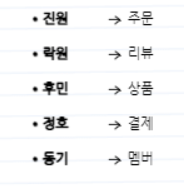

# Coffee

## 컨벤션
- GitMoji

## 선행지식
Webclient, Mono, Flux react   
https://www.youtube.com/watch?v=VeSHa_Xsd2U
https://www.youtube.com/watch?v=2E_1yb8iLKk&t=2692s

## 목표
- 1주차
  - 패키지 구조를 만들어본다
- 2주차 
  - DB 설계, Webflux를 보고 컨트롤러 만든다. 
  -  functional, annotation 방식 둘다 만들자.
- 3주차
  - DB 쿼리 각 MD 파일에 추가
  - 서로가 다르게 알고 있는 각 서비스들 역할 생각해보기
    - 맡은 서비스의 역할 MD파일에 글로 쭉 써보기
  - Entity 만들기
  - product-composite-service에 api 작성
  - coffee 프로젝트로 옮기기

### 프로젝트구성
api service util gateway

### 서비스
주문 상품 결제 회원 리뷰   

### 요구사항
- 주문을 받는다. 회원 번호를 header에 받는다 "X-User-Id"
- 메뉴를 보여준다. 카테고리별, 전체
- 내 주문 조회 "X-User-Id"
- 상품 리뷰, 내가 리뷰한 상품 조회
- 상품 등록
- 회원 가입 가입하면 X-User-Id를 받는다.
- 회원이 상품 결제를 하면 상품 재고와 회원 포인트 차감
- 회원이 포인트를 충전한다.
- 회원 조회
- 환불 기능
- 주문시 옵션 설정
- Rest API 활용
- Webflux 활용
- JPA 인프런 강의 김영한
- 많은 트래픽을 감당할 수 있도록
- api 기반 테스트 코드 작성 
- 등등

### DB
각자 설계

