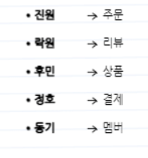

# Coffee

## 컨벤션
- GitMoji

## 선행지식
Webclient, Mono, Flux react   
https://www.youtube.com/watch?v=VeSHa_Xsd2U
https://www.youtube.com/watch?v=2E_1yb8iLKk&t=2692s

## 목표
- 1주차
  - 패키지 구조를 만들어본다
- 2주차 
  - DB 설계, Webflux를 보고 컨트롤러 만든다. 
  -  functional, annotation 방식 둘다 만들자.
- 3주차
  - DB 쿼리 각 MD 파일에 추가
  - 서로가 다르게 알고 있는 각 서비스들 역할 생각해보기
    - 맡은 서비스의 역할 MD파일에 글로 쭉 써보기
  - Entity 만들기
  - product-composite-service에 api 작성
  - coffee 프로젝트로 옮기기
- 4주차
  - master로 머지
  - 3주차 내용들 수정할것들 (~목요일)
    - 각자 만든 모듈의 readme.md에 빌드 할 수 있도록 설명 작성
    - 소스에도 이거 어떤 고민이 있었고 어떤 이유로 이렇게 했다
  - 서로 얘기하는 시간 (~월요일)
    - //TODO 로 질문하기
    - 후민 -> 진원 -> 동기 -> 정호 -> 락원 -> 후민
  
### 프로젝트구성
api service util gateway

### 서비스
주문 상품 결제 회원 리뷰   

### 요구사항
- 주문을 받는다. 회원 번호를 header에 받는다 "X-User-Id"
- 메뉴를 보여준다. 카테고리별, 전체
- 내 주문 조회 "X-User-Id"
- 상품 리뷰, 내가 리뷰한 상품 조회
- 상품 등록
- 회원 가입 가입하면 X-User-Id를 받는다.
- 회원이 상품 결제를 하면 상품 재고와 회원 포인트 차감
- 회원이 포인트를 충전한다.
- 회원 조회
- 환불 기능
- 주문시 옵션 설정
- Rest API 활용
- Webflux 활용
- JPA 인프런 강의 김영한
- 많은 트래픽을 감당할 수 있도록
- api 기반 테스트 코드 작성 
- 등등

### DB
각자 설계

### service
api 하나씩 개발해보기

### API 요청하기
- 후민 - 상품 리스트 가져오기 / 상품 가져오기 dto 수정
- 동기 - 멤버 유효성 체크 (사람 있는지 확인)
- 정호 - 쿠폰 확인(상품,멤버id)
- 락원 - 리뷰 ?? 확인
- 진원 - 주문 하기

### GCP에 올리기
### ProductComposite에 구현

### 패키지 구조 통일하기
push 전에 coffee build 해보고 올리기
test 까지 패키지 통일

### TODO
- 공통 - package 구조 통일 (test까지) / utf-8 인코딩 / GCP 올리기 webclient가 이거 바라보도록 / coffee build 해보기 / ProductComposite로 테스트 / GCP에 올려서 테스트
- 동기 - enum string 변경, api 요청하기 ProductComposite 까지 구현
- 후민 - GCP 올리기
- 락원 - DB 비동기 / ProductComosite 테스트 / GCP 올리기
- 정호 - mapper 추가 / dto 변경 / mongodb 연결해서 테스트 / service 상속 구현 / enum 통일 / ProductComposite
- 진원 - GCP 올리기 / 레포지터리 저장, 조회 비동기 처리 로그 찍어가며 테스트 해오기

Mono.Fromcallable / r2dbc 차이

